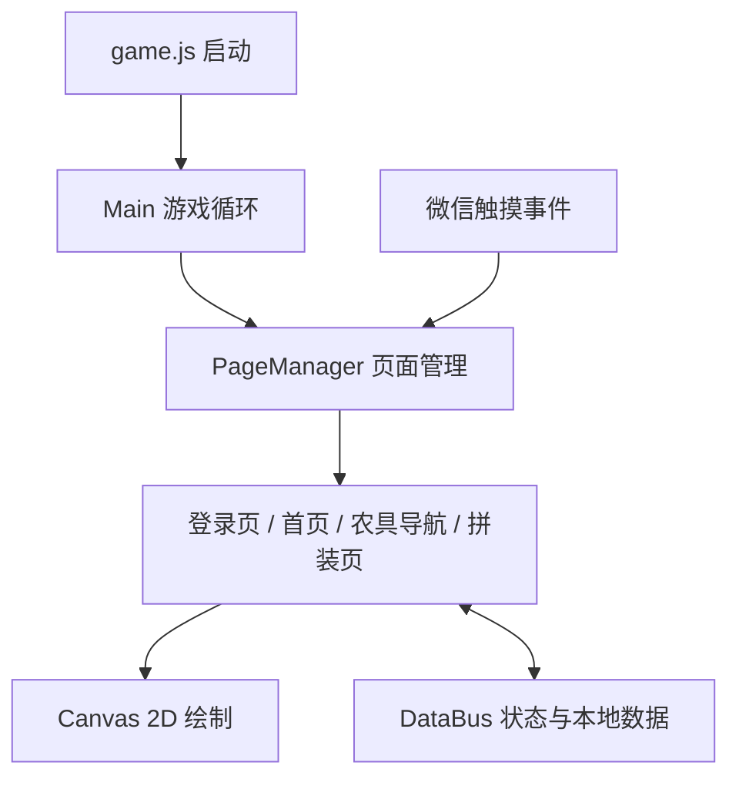

<div align="center">

# FarmingGame · 童趣农耕小天地

**把传统农具拆成可以认识、拖动与拼装的部件，用小游戏探索农耕知识。**


*曲辕犁美术素材，来自本仓库；并非游戏运行截图。*

[玩法设计](#玩法设计) · [当前进度](#当前进度) · [项目结构](#项目结构) · [开发说明](project/README.md)

</div>

## 玩法设计

FarmingGame 是一个横屏农耕教育小游戏原型，采用微信小游戏原生环境和 Canvas 2D 绘制界面。当前代码围绕农具卡片、曲辕犁部件识别与拼装交互展开。

| 认识农具 | 动手拼装 | 获得反馈 |
| --- | --- | --- |
| 浏览曲辕犁、石磨、水车卡片 | 选择犁梢、犁辕、犁箭、犁底、犁铲等部件 | 拼装判定、成功 / 失败提示与重新开始 |
| 卡片支持左右滑动 | 拼装页使用拖拽、多边形目标区与吸附判定 | 结合图片、文字与提示呈现过程 |

这里的“立体组装”使用二维图片和 Canvas 2D 实现视觉效果，没有引入 3D 渲染引擎。

## 当前进度

| 部分 | 源码中的状态 |
| --- | --- |
| 登录页、首页、农具导航 | 已注册页面，包含触摸响应、页面切换和音乐控制代码 |
| 曲辕犁拼装页 | 已有部件拖拽、位置判定、提交反馈和重置实现 |
| 导航卡片进入拼装页 | 曲辕犁卡片点击处理仍保留 TODO，跳转尚未接通 |
| 石磨、水车 | 有卡片素材，目前锁定 |
| 用户与进度数据 | 有微信 API 调用和本地存储；后端请求目前使用模拟返回值 |
| 其他教育模块 | 数据中预留面条、突发挑战、玉米生长等模块，尚未形成完整玩法 |
| 奖杯、用户信息入口 | 当前显示开发中提示 |

> 本仓库适合阅读交互原型与继续开发。页面实现、入口接通和真实后端接入处于不同阶段，不应将其视为已完成上线验收的游戏。

## 项目结构



```text
FarmingGame/
└── project/                  # 微信开发者工具应导入的目录
    ├── game.js               # 小游戏入口
    ├── game.json             # 横屏配置
    ├── config/               # 常量与游戏配置
    ├── images/               # 农具、部件、背景与界面素材
    ├── audio/                # 音频资源
    └── js/
        ├── pages/            # 页面与当前拼装交互
        ├── components/       # Toast 等组件
        ├── game/             # 场景、实体和系统相关代码
        ├── utils/            # 微信 API、动画与工具
        └── databus.js        # 共享状态
```

## 开始阅读与开发

```bash
git clone https://github.com/2intro2/FarmingGame.git
```

在微信开发者工具中以**小游戏**导入 `FarmingGame/project`，配置你有权限使用的小游戏 AppID。项目依赖 `wx`、`GameGlobal` 和小游戏 Canvas，不能当作普通网页直接打开。

环境配置、页面注册、核心源码入口和当前限制见 **[开发说明](project/README.md)**。上述导入方式依据仓库配置整理，本次未运行微信开发者工具或验证真机表现。

---

欢迎通过 [Issues](https://github.com/2intro2/FarmingGame/issues) 交流玩法与交互建议，通过 Pull Request 参与开发。原文档中的许可声明保留于 [开发说明的许可证章节](project/README.md#许可证)。
